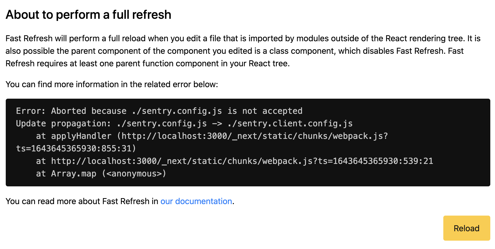

# Logrocho Frontend

Frontend desarrollado en [Nextjs](https://nextjs.org/) para la plataforma "Logrocho".

## Iniciar Proyecto

### Requisitos

1. Nodejs >= 16

2. Backend en XAMPP o WAMP

### Instalar dependencias

Abre un terminal y ejecuta:

```bash

npm install

```

### Iniciar servidor de desarrollo

⚠️ Edita el fichero lib/const.ts y en la constante API_URL añade la ruta {XAMPP o WAMP}/index.php/api/ ⚠️

⚠️ Edita el fichero lib/const.ts y en la constante IMG_URL añade la ruta {XAMPP o WAMP}/img/ ⚠️

Abre un terminal y ejecuta:

```bash

npm run dev

```

Abrir [http://localhost:3000](http://localhost:3000) en tu navegador para ver el resultado.


### Consideraciones

Para poder acceder a ciertas paginas hay que iniciar sesion.

email: correo@test.com
password: admin

Si utilizando la web te encuentras con un error como este:


Es un problema del framework, yo no puedo hacer nada al respecto hasta que lo actualizen... 😢😢
